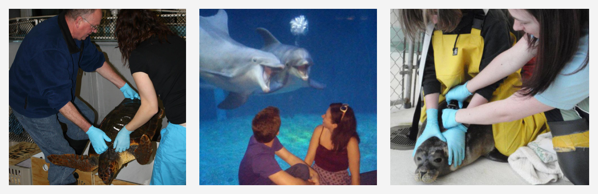
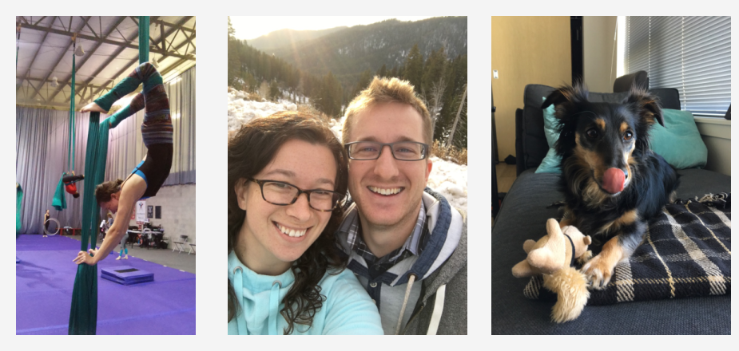

```{r, echo = FALSE, warning = FALSE, message = FALSE}
library(knitr)
library(magick)
"print.magick-image" <- function(x, ...){
  ext <- ifelse(length(x), tolower(image_info(x[1])$format), "gif")
  tmp <- tempfile(fileext = paste0(".", ext))
  image_write(x, path = tmp)
  knitr::include_graphics(tmp)
}
```

```{r setup, include=FALSE}
knitr::opts_chunk$set(echo = TRUE)
```

### TL;DR
I'm a marine biologist and science communicator by training, but I'm taking all of the data analysis, statistics, and mathematical modeling skills I've learned (and continue to learn) and I'm now applying them to new problems. I'm a full-time "Journalist-Engineer" at [Polygraph](http://polygraph.cool/) and [The Pudding](https://pudding.cool/).  

### The Long Version
Hey there, I’m Amber. Professionally-speaking, I took a bit of a winding road to get to where I am now. By training, I’m a marine biologist. I studied marine biology (and chemistry) in college, followed it up with a Master’s in Marine Sciences, and ended up with a full-blown job as an Aquatic Research Associate at an aquarium (yes, that’s a real thing). Throughout school and work, I never really found a niche field that was more fascinating than the rest, which is generally frowned upon in focused academic work.  Luckily for me, I was allowed (and encouraged) to be flexible, so I’ve spent time studying seal pups, cuttlefish, parasites, water chemistry, sting-rays, dolphins, corals and other under-water topics and critters.  When explaining my job as a scientist to visiting children, I started referring to myself as a Professional Question-Asker (hence the seemingly strange Twitter handle @[ProQuesAsker](www.twitter.com/proquesasker)). I’d tell them that my job was to ask questions about the animals around me and do my best to find ways to answer those questions. It was the perfect description of my work and the ideal segue to finding my next career.

```{r,  echo = FALSE, message = FALSE, fig.align = "center", out.width = "90%"}
library(magick)
library(magrittr)


turtle <- image_read("images/turtle.jpg") %>% 
  image_scale("400") %>% 
  image_scale("x400") %>% 
  image_border("#f4f4f4", "20x20")

dolphin <- image_read("images/dolphin.jpg") %>% 
  image_scale("400") %>% 
  image_scale("x400") %>% 
  image_border("#f4f4f4", "10x20")

seal <- image_read("images/seal_1.jpg") %>% 
  image_scale("400") %>% 
  image_scale("x400") %>% 
  image_border("#f4f4f4", "20x20")

animals <- c(turtle, dolphin, seal)


all_animals <- image_append(animals)
image_write(all_animals, path = "images/all_animals.png",format = "png")


```

You see, when people tell you that marine biology is a hard field to find/maintain steady employment, they aren’t kidding. As much as I enjoyed studying life beneath the waves, I decided that I should consider pivoting slightly to a different career field. For a while I had considered pursuing science communication since I loved breaking complex topics down into simple, easy-to-digest pieces. I even co-founded a [sci-comm service](www.unbox.science) to help others communicate their work.  But I kept searching. I took stock of the pieces of my job that I enjoyed the most: data analysis, data visualization, and story-telling. I had no idea how these pieces would fit together yet, but beefing up my data skills seemed to be a good place to start. After a few months of expanding my skillset beyond the statistics and simple R-programming I’d used as a scientist and creating lots of personal projects, I found [The Pudding](www.pudding.cool) team and have been lucky enough to get to work with them in some capacity ever since. These days I get to ask questions about a [wide variety of topics](www.proquestionasker.github.io/work), analyze lots of data, create fun and interactive visualizations, and tell stories.  It’s been a pretty great career-move, if you ask me!

On a more personal note, my physical locations have also been on a bit of a winding path. I grew up and attended all levels of school in New England (Connecticut, Rhode Island, Maine, fwiw).  I moved to Orlando, FL for work and survived the scorching heat for a few years, and have recently relocated to Seattle, WA with my boyfriend (no, it doesn’t really rain every day). We have a dog that I’m ~~mildly~~ obsessed with. His name is Sherlock. He’s a long-haired dachshund-mix. If you and I are having a video call, there’s about an 80% chance that Sherlock’s snoozing away on my lap while we chat. In my free time, I like to hike, read, watch way too much Netflix, and practice aerial arts (particularly aerial silks -- think Cirque du Soleil type things). Care to chat about anything I mentioned or something I left out? Find me on Twitter @[ProQuesAsker](www.twitter.com/proquesasker) or [email me](www.proquestionasker.github.io/contact).

```{r,  echo = FALSE, message = FALSE, fig.align = "center", out.width = "90%"}
aerial <- image_read("images/aerialArts.jpg") %>% 
  image_scale("400") %>% 
  image_scale("x400") %>% 
  image_border("#f4f4f4", "20x20")

Sherlock_2 <- image_read("images/Sherlock_2.jpg") %>% 
  image_scale("400") %>% 
  image_scale("x400") %>% 
  image_border("#f4f4f4", "10x20")

Parker <- image_read("images/Parker.jpg") %>% 
  image_scale("400") %>% 
  image_scale("x400") %>% 
  image_border("#f4f4f4", "20x20")

photos <- c(aerial, Parker, Sherlock_2)


allPhotos <- image_append(photos)
image_write(allPhotos, path = "images/all_Photos.png",format = "png")

```
