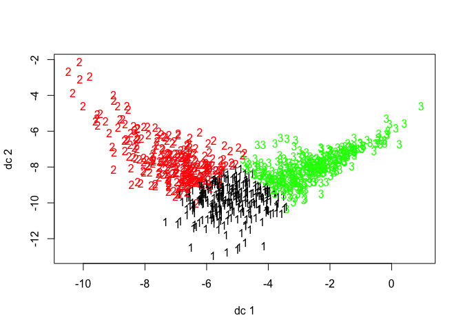

+++
showonlyimage = true
draft = false
image = "projects/Ghosts_Goblins_Ghouls_02_files/GGG_Boxplot.jpg"
date = "2016-11-09"
title = "Ghosts, Goblins, and Ghouls"
weight = 0
type = "post"
author = "Amber Thomas"
tags = [
 "machine learning",
 "data viz"
]
+++
Kaggle Playground Competition

Data exploration and machine learning in RMarkdown.
<!--more-->
Introduction
------------

-   [Introduction](#introduction)
    -   [Loading Necessary Packages](#loading-necessary-packages)
    -   [Importing Data](#importing-data)
-   [Data Exploration](#data-exploration)
    -   [Distribution of Continuous Variables by Creature Type](#distribution-of-continuous-variables-by-creature-type)
    -   [Distribution of Color by Creature Type](#distribution-of-color-by-creature-type)
    -   [Distinguishing Features?](#distinguishing-features)
-   [Feature Engineering](#feature-engineering)
-   [Cleaning Data](#cleaning-data)
-   [Clustering data](#clustering-data)
    -   [Cluster Without Categorical Variables](#cluster-without-categorical-variables)
    -   [Modeling for Creature Identity](#modeling-for-creature-identity)
    -   [Creating trainControl](#creating-traincontrol)
    -   [Random Forest Modeling](#random-forest-modeling)
    -   [GLMnet Modeling](#glmnet-modeling)
    -   [Comparing model fit](#comparing-model-fit)
-   [Predicting Creature Identity](#predicting-creature-identity)
    -   [Preparing the prediction for Kaggle](#preparing-the-prediction-for-kaggle)
    -   [Testing with Kaggle](#testing-with-kaggle)

Introduction
------------

This is my second-ever Kaggle competition (looking for the [first](https://www.kaggle.com/amberthomas/titanic/predicting-survival-on-the-titanic)?) I'll do my best to walk through my thought-process here and welcome any comments on my work. Let's get started!

### Loading Necessary Packages

``` r
# For data manipulation and tidying
library(dplyr)

# For data visualizations
library(ggplot2)
library(fpc)

# For modeling and predictions
library(caret)
library(glmnet)
library(ranger)
library(e1071)
library(clValid)
```

### Importing Data

The data were downloaded directly from the [Kaggle Website](https://www.kaggle.com/c/ghouls-goblins-and-ghosts-boo/data). Before binding the training and test sets into a single data file, I added a column called "Dataset" and labelled rows from the training file "train" and rows from the testing file "test".

``` r
train <- read.csv(file = "train.csv", header = TRUE, stringsAsFactors = FALSE)
train$Dataset <- "train"

test <- read.csv(file = "test.csv", header = TRUE, stringsAsFactors = FALSE)
test$Dataset <- "test"

full <- bind_rows(train, test)
```

Ok, time to take a look at the data.

``` r
str(full)
```

    ## 'data.frame':    900 obs. of  8 variables:
    ##  $ id           : int  0 1 2 4 5 7 8 11 12 19 ...
    ##  $ bone_length  : num  0.355 0.576 0.468 0.777 0.566 ...
    ##  $ rotting_flesh: num  0.351 0.426 0.354 0.509 0.876 ...
    ##  $ hair_length  : num  0.466 0.531 0.812 0.637 0.419 ...
    ##  $ has_soul     : num  0.781 0.44 0.791 0.884 0.636 ...
    ##  $ color        : chr  "clear" "green" "black" "black" ...
    ##  $ type         : chr  "Ghoul" "Goblin" "Ghoul" "Ghoul" ...
    ##  $ Dataset      : chr  "train" "train" "train" "train" ...

``` r
summary(full)
```

    ##        id         bone_length     rotting_flesh     hair_length    
    ##  Min.   :  0.0   Min.   :0.0000   Min.   :0.0000   Min.   :0.0000  
    ##  1st Qu.:224.8   1st Qu.:0.3321   1st Qu.:0.4024   1st Qu.:0.3961  
    ##  Median :449.5   Median :0.4268   Median :0.5053   Median :0.5303  
    ##  Mean   :449.5   Mean   :0.4291   Mean   :0.5050   Mean   :0.5222  
    ##  3rd Qu.:674.2   3rd Qu.:0.5182   3rd Qu.:0.6052   3rd Qu.:0.6450  
    ##  Max.   :899.0   Max.   :1.0000   Max.   :1.0000   Max.   :1.0000  
    ##     has_soul         color               type             Dataset         
    ##  Min.   :0.0000   Length:900         Length:900         Length:900        
    ##  1st Qu.:0.3439   Class :character   Class :character   Class :character  
    ##  Median :0.4655   Mode  :character   Mode  :character   Mode  :character  
    ##  Mean   :0.4671                                                           
    ##  3rd Qu.:0.5892                                                           
    ##  Max.   :1.0000

Great! So here's what we know so far:

We have 8 variables currently:

-   **ID** : Appears to be the identification number of the monster in question
-   **Bone Length** : Average length of the bones in the creature, normalized to 0 - 1
-   **Rotting Flesh** : Percentage of flesh on the creature that is rotting
-   **Hair Length** : Average length of the hair on the creature, normalized from 0 - 1
-   **Has Soul** : The percentage of a soul present in the creature
-   **Color** : The color of the creature
-   **Type** : The category of the creature (i.e. ghoul, goblin or ghost)
-   **Dataset** : The column I added when importing data indicating whether the observation was part of the original training or test set

It seems like a few of these variables would serve better as factors, rather than character strings, so I'll take care of that.

``` r
factor_variables <- c("id", "color", "type", "Dataset")
full[factor_variables] <- lapply(full[factor_variables], function(x) as.factor(x))
```

Data Exploration
----------------

Let's take a look at what we've got here so far. What's the distribution of each variable across each monster?

Let's first temporarily remove the "test" rows.

``` r
train_2 <- full[full$Dataset == "train", ]
```

### Distribution of Continuous Variables by Creature Type

#### Bone Length


#### Rotting Flesh


#### Hair Length


#### Soul


### Distribution of Color by Creature Type

#### Ghost


#### Ghoul


#### Goblin


### Distinguishing Features?

Hmm, looks like ghosts have shorter hair and fewer pieces of soul than ghouls and goblins, but otherwise are pretty close. Ghouls and goblins are going to be tricky to distinguish. Color doesn't appear to help a whole lot as there seems to be a pretty even distribution to these multi-colored critters.

Feature Engineering
-------------------

Normally here I would try to come up with additional ways to look at these data, but we can't infer the size of the creature since both bone and hair length have been normalized. As of now, I can't think of any features worth engineering from the current data.

Maybe I'm missing some interesting connection between variables?

``` r
pairs(full[, 2:5], col = full$type, labels = c("Bone Length", 
    "Rotting Flesh", "Hair Length", "Soul"))
```


Nope. But perhaps we can take advantage of a combination of characteristics that do seem to show some promise: most notably "Hair Length" and "Soul". Do we get any better separation among creatures if we combine these variables into one?

``` r
full <- full %>% mutate(hair_soul = hair_length * has_soul)
```


That may have separated Ghosts a little further from the other two... Let's try a few more variable interactions.

``` r
full <- full %>% mutate(bone_flesh = bone_length * rotting_flesh, 
    bone_hair = bone_length * hair_length, bone_soul = bone_length * 
        has_soul, flesh_hair = rotting_flesh * hair_length, flesh_soul = rotting_flesh * 
        has_soul)
```

Time to check for ways to tidy up.

Cleaning Data
-------------

Let's take another look at the summary statistics for this dataset.

``` r
summary(full)
```

    ##        id       bone_length     rotting_flesh     hair_length    
    ##  0      :  1   Min.   :0.0000   Min.   :0.0000   Min.   :0.0000  
    ##  1      :  1   1st Qu.:0.3321   1st Qu.:0.4024   1st Qu.:0.3961  
    ##  2      :  1   Median :0.4268   Median :0.5053   Median :0.5303  
    ##  3      :  1   Mean   :0.4291   Mean   :0.5050   Mean   :0.5222  
    ##  4      :  1   3rd Qu.:0.5182   3rd Qu.:0.6052   3rd Qu.:0.6450  
    ##  5      :  1   Max.   :1.0000   Max.   :1.0000   Max.   :1.0000  
    ##  (Other):894                                                     
    ##     has_soul        color         type      Dataset      hair_soul     
    ##  Min.   :0.0000   black:104   Ghost :117   test :529   Min.   :0.0000  
    ##  1st Qu.:0.3439   blood: 21   Ghoul :129   train:371   1st Qu.:0.1322  
    ##  Median :0.4655   blue : 54   Goblin:125               Median :0.2448  
    ##  Mean   :0.4671   clear:292   NA's  :529               Mean   :0.2588  
    ##  3rd Qu.:0.5892   green: 95                            3rd Qu.:0.3631  
    ##  Max.   :1.0000   white:334                            Max.   :0.7768  
    ##                                                                        
    ##    bone_flesh       bone_hair        bone_soul        flesh_hair    
    ##  Min.   :0.0000   Min.   :0.0000   Min.   :0.0000   Min.   :0.0000  
    ##  1st Qu.:0.1473   1st Qu.:0.1361   1st Qu.:0.1136   1st Qu.:0.1847  
    ##  Median :0.2039   Median :0.2194   Median :0.1944   Median :0.2473  
    ##  Mean   :0.2159   Mean   :0.2330   Mean   :0.2098   Mean   :0.2585  
    ##  3rd Qu.:0.2701   3rd Qu.:0.3191   3rd Qu.:0.2810   3rd Qu.:0.3242  
    ##  Max.   :0.7887   Max.   :0.7779   Max.   :0.6869   Max.   :0.7478  
    ##                                                                     
    ##    flesh_soul    
    ##  Min.   :0.0000  
    ##  1st Qu.:0.1539  
    ##  Median :0.2163  
    ##  Mean   :0.2316  
    ##  3rd Qu.:0.2991  
    ##  Max.   :0.7195  
    ## 

The only column that has any missing values is `type` which is to be expected since that's what we need to be predicting. Everything else seems to look good so far. Let's try to model these as is.

Clustering data
---------------

While clustering is generally used for unsupervised machine learning, I want to take a peek at the clusters that could be formed using the data at hand. The potential issue with trying to cluster this data is that we are working with two types of data: continuous and categorical. They break down like this:

| Continuous Variables | Categorical Variables |
|----------------------|-----------------------|
| bone length          | id                    |
| rotting flesh        | color                 |
| hair length          |                       |
| has soul             |                       |

So, sure, there's only two categorical variables. Because of our small sample size, it's not a good idea to count out these variables completely, but we'll try to create clusters without them just to see how well the clustering models do.

### Cluster Without Categorical Variables

I'll first try to cluster using the `kmeans` function.

``` r
# Set the seed
set.seed(100)

# Extract creature labels and remove column from dataset
creature_labels <- full$type
full2 <- full
full2$type <- NULL

# Remove categorical variables (id, color, and dataset) from
# dataset
full2$id <- NULL
full2$color <- NULL
full2$Dataset <- NULL

# Perform k-means clustering with 3 clusters, repeat 30 times
creature_km_1 <- kmeans(full2, 3, nstart = 30)
```

Ok, so now we have clusters, time to see how well they did. Let's look at them graphically first. This was created using the `plotcluster()` function from the `fpc` package.



Hmm, those clusters don't look very discrete. Let's look at [Dunn's Index](https://en.wikipedia.org/wiki/Dunn_index) mathematically to see if we're missing something visually. This calculation comes from the `dunn` function in the `clValid` package.

``` r
dunn_ckm_1 <- dunn(clusters = creature_km_1$cluster, Data = full2)

# Print results
dunn_ckm_1
```

    ## [1] 0.04670431

As Dunn's Index represents a ratio of the smallest distance between clusters to the largest distance between two points in the same cluster (or, the smallest inter-cluster distance to the largest intra-cluster distance), such a low number indicates that our current clusters are not condensed, separate entities. This is not terribly surprising considering we completely disregarded one of our variables.

Let's see how well this clustering method correctly separated the labelled creatures.

``` r
table(creature_km_1$cluster, creature_labels)
```

    ##    creature_labels
    ##     Ghost Ghoul Goblin
    ##   1     7    39     75
    ##   2     4    86     24
    ##   3   106     4     26

It looks like currently, ghosts were separated relatively well, but ghouls and goblins are split between the clusters. Ok, I'm convinced. I haven't really gained any new information here, but it's been an interesting exploratory path!

On to supervised modeling!

### Modeling for Creature Identity

Clustering was not particularly helpful in discerning creature identity, so perhaps creating models will work better.

First things first, I need to split out the test and training data back into separate datasets.

``` r
train_complete <- full[full$Dataset == "train", ]
test_complete <- full[full$Dataset == "test", ]
```

Because I plan on using the `caret` package for all of my modeling, I'm going to generate a standard `trainControl` so that those tuning parameters remain consistent throughout the various models.

### Creating trainControl

I will create a system that will perform 20 repeats of a 10-Fold cross-validation of the data.

``` r
myControl <- trainControl(method = "cv", number = 10, repeats = 20, 
    verboseIter = TRUE)
```

### Random Forest Modeling

Let's start with a random forest model, generated using the `ranger` and `caret` packages. I'm going to include all of the original variables, including any interactions here.

``` r
set.seed(10)

rf_model <- train(type ~ bone_length + rotting_flesh + hair_length + 
    has_soul + color + hair_soul + bone_flesh + bone_hair + bone_soul + 
    flesh_hair + flesh_soul, tuneLength = 3, data = train_complete, 
    method = "ranger", trControl = myControl, importance = "impurity")
```

Let's look at the levels of importance of each factor in this model.


Huh. Our "hair\_soul" variable seems to be the most important to this model and our other interactions rank pretty highly. I suppose we can hold on to them for now. Color, on the other hand, hardly plays into this. Let's try removing it from a second random forest model.

``` r
set.seed(10)

rf_model_2 <- train(type ~ bone_length + rotting_flesh + hair_length + 
    has_soul + hair_soul + bone_flesh + bone_hair + bone_soul + 
    flesh_hair + flesh_soul, tuneLength = 3, data = train_complete, 
    method = "ranger", trControl = myControl, importance = "impurity")
```

### GLMnet Modeling

I'm going to follow the random forest model up with a glmnet model, also from the `caret` package.

``` r
set.seed(10)

glm_model <- train(type ~ bone_length + rotting_flesh + hair_length + 
    has_soul + color + hair_soul + bone_flesh + bone_hair + bone_soul + 
    flesh_hair + flesh_soul, method = "glmnet", tuneGrid = expand.grid(alpha = 0:1, 
    lambda = seq(1e-04, 1, length = 20)), data = train_complete, 
    trControl = myControl)
```

Once again, we'll try without "color".

``` r
set.seed(10)

glm_model_2 <- train(type ~ bone_length + rotting_flesh + hair_length + 
    has_soul + hair_soul + bone_flesh + bone_hair + bone_soul + 
    flesh_hair + flesh_soul, method = "glmnet", tuneGrid = expand.grid(alpha = 0:1, 
    lambda = seq(1e-04, 1, length = 20)), data = train_complete, 
    trControl = myControl)
```

### Comparing model fit

Now that we have two random forest models and two glmnet models, it's time to compare their fit.

``` r
# Create a list of models
models <- list(rf = rf_model, rf2 = rf_model_2, glmnet = glm_model, 
    glmnet2 = glm_model_2)

# Resample the models
resampled <- resamples(models)

# Generate a summary
summary(resampled)
```

    ## 
    ## Call:
    ## summary.resamples(object = resampled)
    ## 
    ## Models: rf, rf2, glmnet, glmnet2 
    ## Number of resamples: 10 
    ## 
    ## Accuracy 
    ##           Min. 1st Qu. Median   Mean 3rd Qu.   Max. NA's
    ## rf      0.6389  0.6888 0.7201 0.7194  0.7566 0.7838    0
    ## rf2     0.6667  0.6888 0.7105 0.7195  0.7500 0.7895    0
    ## glmnet  0.6842  0.7222 0.7333 0.7438  0.7616 0.8649    0
    ## glmnet2 0.6842  0.7047 0.7500 0.7547  0.7829 0.8649    0
    ## 
    ## Kappa 
    ##           Min. 1st Qu. Median   Mean 3rd Qu.   Max. NA's
    ## rf      0.4577  0.5337 0.5801 0.5789  0.6347 0.6754    0
    ## rf2     0.4977  0.5337 0.5664 0.5791  0.6247 0.6837    0
    ## glmnet  0.5265  0.5833 0.5988 0.6156  0.6428 0.7965    0
    ## glmnet2 0.5260  0.5555 0.6254 0.6321  0.6758 0.7965    0

``` r
# Plot the differences between model fits
dotplot(resampled, metric = "Accuracy")
```


Predicting Creature Identity
----------------------------

Although I generated four models above, the second glmnet model (all interactions but without color) provided the highest accuracy, so I'll use that model to predict survival in the test set.

``` r
# Reorder the data by creature ID number
test_complete <- test_complete %>% arrange(id)

# Make predicted survival values
my_prediction <- predict(glm_model_2, test_complete)
```

### Preparing the prediction for Kaggle

The instructions on Kaggle indicate that they are expecting a csv file with 2 columns: ID and Creature Type. I need to make sure that my data are arranged properly.

``` r
# Create a data frame with two columns
my_solution_GGG_03 <- data.frame(id = test_complete$id, Type = my_prediction)

# Write the solution to a csv file
write.csv(my_solution_GGG_03, file = "my_solution_GGG_03.csv", 
    row.names = FALSE)
```

### Testing with Kaggle

Looks like that submission scored 0.74669! Not bad!!

*I'd love to hear any feedback you may have on this process. Thanks in advance!*
